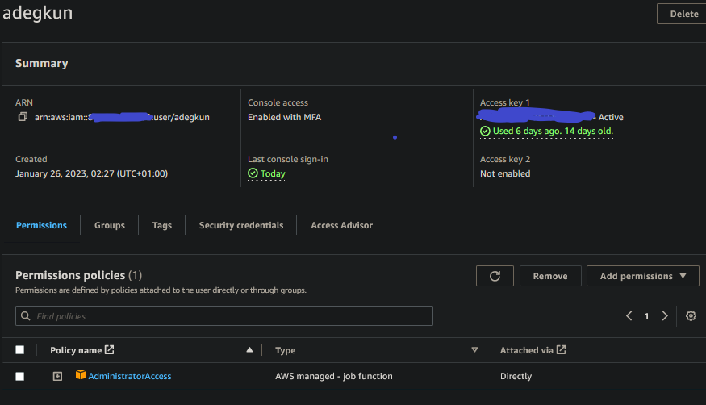
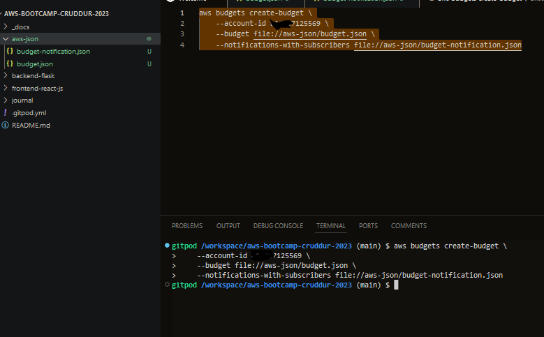
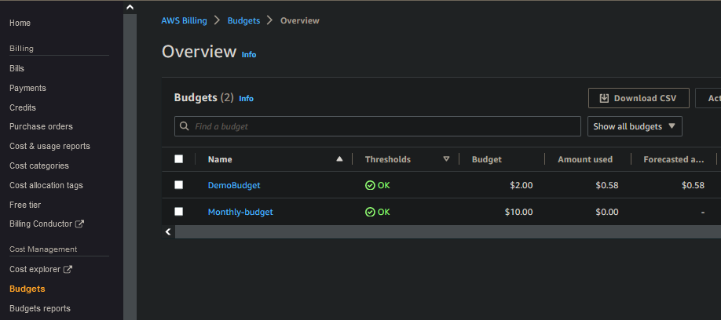
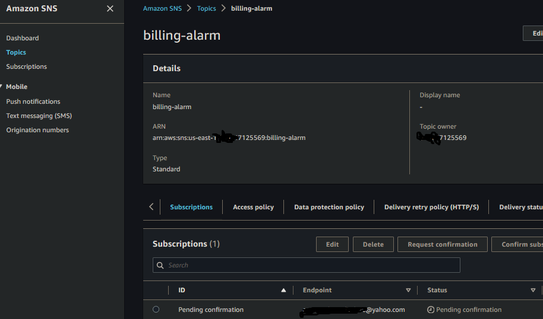
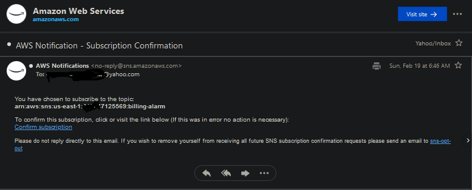
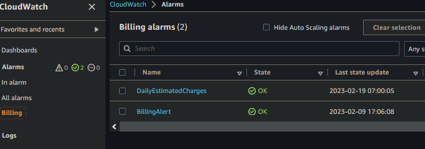

# Week 0 — Billing and Architecture

# Architecture Diagram 

I recreated the architecture diagram with lucid chart

[Lucid Chart share Link](https://lucid.app/lucidchart/a6a84a9a-e16c-4617-8b1b-ea8e63971a56/edit?viewport_loc=-111%2C-39%2C2091%2C1119%2C0_0&invitationId=inv_604b53a6-736f-4aa8-acec-03368292daa0)

# Create an Admin User

I created an admin user and also set up MFA for added security 

# Setup Budgets with AWS CLI

I was able to setup up a $10 monthly budget and notification with subcribers programmatically via the AWS CLI on gitpod

# Setup Billing Alarm and SNS Topic 

I learnt how to setup an SNS topic that was used to create a billing alarm on Cloudwatch. It was done via the AWS CLI

