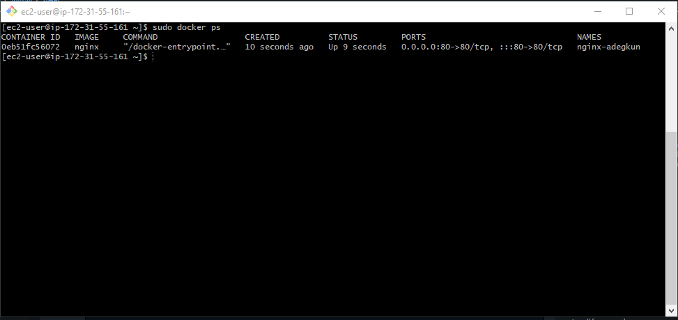
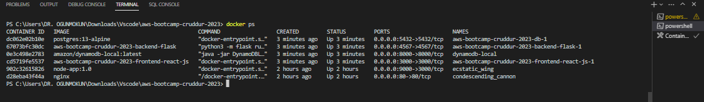

# Week 1 — App Containerization

# Run Docker on EC2 instance 

Follow below steps to install and run nginx container on Ec2

```
sudo yum update -y
sudo yum install docker 
sudo systemctl start docker
sudo systemctl enable docker
```

Confirm Docker is running 


```
systemctl status docker
```

Pull and Run a nginx container 
```
sudo docker pull nginx
sudo docker run -p 80:80 --name nginx-server -d nginx
```

List Docker images  
```
sudo docker images 
```

List Running Containers
```
sudo docker ps
```



Stop Running Containers
```
sudo docker stop <Container-ID> --- Insert Container ID
```
# Deployed app on local machine

I installed docker-desktop on windows and deloyed app on local machine



# Push Image to DockerHub

Create a repository for the image in DockerHub
```
docker build -t crudbackend-app:1.0 .
docker image tag crudbackend-app:1.0  adegkun/crudbackend-app:1.0
docker push adegkun/crudbackend-app:1.0
```


